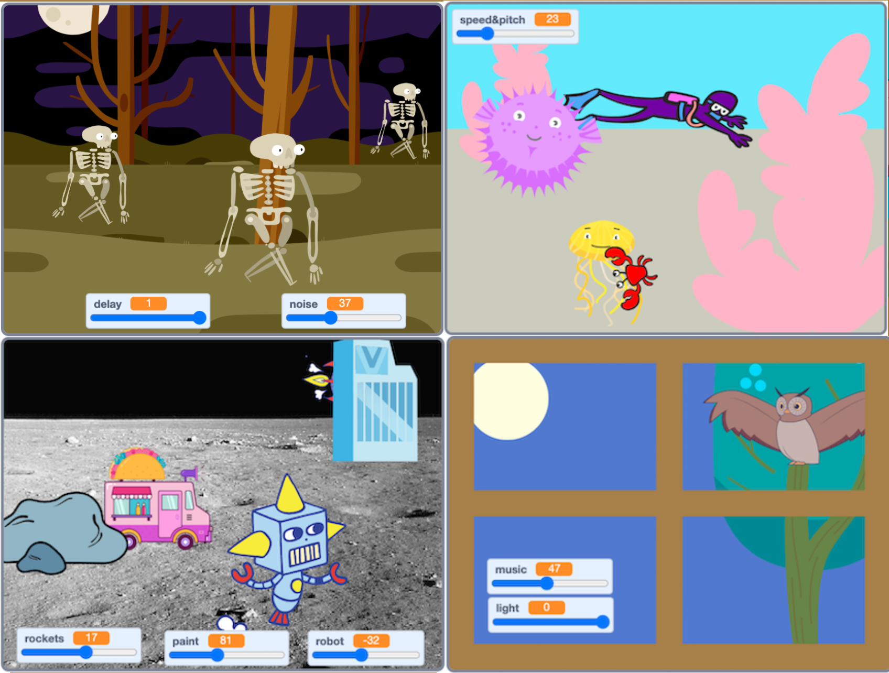

## Introduction
You will create a three-dimensional (3D) scene that can be controlled with variables. The user will be able to act as the 'director' of the scene and play around until they get it just the way that they want it. 

Your scene does not have to be sensible. You should try to make it fun for you and other people to play around with. 

## What you will make
You will create a scene that uses `layers`{:class="block3looks"}, `size`{:class="block3looks"}, `sound`{:class="block3sound"}, and `motion`{:class="block3motion"} to create a 3D effect. You will add `variables`{:class="block3variables"} with sliders to control features of your scene so that the user can play around and customise the scene. 

You will see some examples and then plan your own scene. You will apply your coding and graphics skills to make a unique 3D scene of your own.  

{:width="500px"}

--- collapse ---
---
title: What you will need
---
### Hardware

+ A computer or tablet capable of running Scratch
+ This project features sound — headphones are recommended

### Software

+ Scratch 3.0 (either [online](https://rpf.io/scratchon){:target="_blank"} or [offline](https://rpf.io/scratchoff){:target="_blank"})

--- /collapse ---

--- collapse ---
---
title: Skills you should have
---
Before you start this project, we recommend that you complete the first three projects in the [Look after yourself](https://projects.raspberrypi.org/en/pathways/look-after-yourself){:target="_blank"} pathway: 
+ [Stress ball](https://projects.raspberrypi.org/en/projects/stress-ball){:target="_blank"}
+ [Butterfly garden](https://projects.raspberrypi.org/en/projects/butterfly-garden){:target="_blank"}
+ [Serene scene](https://projects.raspberrypi.org/en/projects/serene-scene){:target="_blank"}

For this project, you need to know how to:  

+ Customise sprites in the Paint editor
+ Add `graphic effects`{:class="block3looks"}, `motion`{:class="block3motion"}, and `sound`{:class="block3sound"} to a sprite
+ Use the `forever`{:class="block3control"} block
+ Use the `next costume`{:class="block3looks"} and `wait`{:class="block3control"} blocks to animate a sprite
+ Make a `variable`{:class="block3control"}, turn it into a slider with a range, and use it as an input to a block
+ Use `layers`{:class="block3looks"} blocks to move sprites in front of or behind other sprites

--- /collapse ---

--- collapse ---
---
title: What you will learn
---

+ How to explore the potential of Scratch to program a 3D scene
+ How to create plan your time to create an interactive and engaging project
+ How to improve your project using feedback from others

--- /collapse ---

