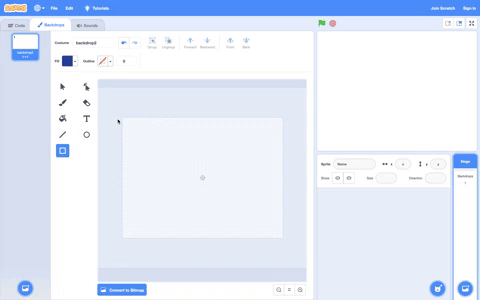

## Set the scene

In this step, you will set the scene by creating or choosing a backdrop. You will also create and/or choose sprites to go in front of the backdrop. In this step, you will also drag your sprites to layer them.

**Jumping shark**: [See inside](https://scratch.mit.edu/projects/454124566/editor){:target="_blank"}

--- no-print ---

  <iframe src="https://scratch.mit.edu/projects/454124566/embed" allowtransparency="true" width="485" height="402" frameborder="0" scrolling="no" allowfullscreen></iframe>

A backdrop is **always** at the back and cannot move. In this example project, the backdrop is the orange **Sky**. 

Sprites can move around the Stage, and be in front of or behind other sprites. In this example project, the **Shark** sprite is able to jump from behind the waves because the waves are not drawn on the backdrop. The **Waves** are a sprite.

--- /no-print ---

--- task ---

Use the Paint editor to create your own backdrop and scenery sprites or **Choose a Backdrop** and **Choose a Sprite** from the Scratch Libraries.

--- collapse ---
---

title: Create a plain backdrop

---

To make your own backdrop:
+ Go to the Stage pane and click on **backdrop1**.

{:width="400px"}

+ Click on the **Backdrops** tab.
+ Choose a **Fill** colour. Click on **Outline** and deselect it (to do this, click on the box with the diagonal line in the bottom left-hand corner of the menu).
+ Click on the **Rectangle** tool (shown as an outline in the Paint editor) and draw a rectangle, ensuring that you cover all of the Stage. 

{:width="400px"}

Add a horizon line if it fits in with your 3D scenery idea:

{:width="400px"}

+ Again, in **backdrop1**, select a suitable **Fill** colour with no **Outline**.
+ Add a **Rectangle** for flat ground or an **Oval** for a hill.

{:width="400px"}

+ Remember to name your backdrop.

--- /collapse ---

**Or**

--- collapse ---
---

title: Choose a backdrop from the Backdrop Library

---

In the bottom right-hand corner of the Stage pane, click on **Choose a Backdrop**.

You can search for a backdrop, or browse for one by category or theme. Click on a backdrop to select it.

--- /collapse ---

--- /task ---

--- task ---

Add any sprites that you want to use from the Sprite Library. This can include people, animals, or vehicles. It can also include existing scenery sprites such as trees, rocks, or buildings. 

Remember that all sprites in Scratch can move, so if you want your main character to be a bunch of bananas, that's fine!

--- collapse ---
---

title: Add sprites from the Sprite Library

---

In the Sprite pane, click on **Choose a Sprite** to see the library of all Scratch sprites.

You can search or browse sprites by theme. Click on a sprite to add it to your project.

--- /collapse ---

--- /task ---

**Tip:** Whenever you drag a sprite, it will jump to the front layer and in front of any other sprites.

--- task ---
Use the Paint editor to create any additional sprites that you need as scenery. This could be hills or mountains in the distance, or smaller sprites, such as trees or flowers. 

Think about whether you want to create your scenery as one sprite **or** whether you want to create separate scenery sprites. If you create separate scenery sprites, some of your sprites will be able to move through and behind the 3D scenery. That will make it easier for you to move sprites around later, depending on your ideas for your project.

--- collapse ---
---

title: Create scenery as sprites

---

**Hill as a sprite**: [See inside](https://scratch.mit.edu/projects/452582516/editor){:target="_blank"}

{:width="400px"}

To make your own **Hill** sprite, shown in the example above, you can use the **Circle** and **Rectangle** tools in the Paint editor:

+ Go to **Choose a Sprite** and select **Paint** to create a new sprite costume.

{:width="400px"}

+ Choose a **Fill** colour. Click on **Outline** and deselect it (to do this, click on the box with the diagonal line in the bottom left-hand corner of the menu). Now, draw an oval using the **Circle** tool. Then, select the **Rectangle** tool to draw a rectangle underneath the oval.

+ If you use varying colours for the shapes, you may need to use the **Front** and **Back** tools in the Paint editor to move your shapes forward or backward so that they are positioned correctly within your background.

+ You can select all the shapes and **Group** them together so that you can adjust them or move them as one shape.

{:width="400px"}

+ Now, make other sprites for your scenery, if this fits in with your project idea.

+ Remember to name your sprite(s).

--- /collapse ---

Here are some other creative tips:

--- collapse ---
---

title: Use the Line tool to create a triangle

---

You can create polygons such as a triangle and use these shapes to create roofs or mountains.

Go to **Choose a Sprite** and select **Paint** to create a new sprite costume. In this example, you will make houses.

**House**: [See inside](https://scratch.mit.edu/projects/453595663/editor){:target="_blank"}

{:width="400px"}

If you follow the instructions below, you can use the **Line** tool to create any shape:
+ Choose a **Fill** colour. To choose the colour black, decrease the **Brightness** to zero (0).

{:width="150px"}

+ Select **No outline**.

{:width="200x"}

+ Use the **Rectangle** tool to draw a rectangle.
+ Use the **Line** tool to draw a triangle. Make sure that you complete the triangle, otherwise it will not fill with colour.
+ Move the two shapes together.
+ Select the **Fill (Bucket)** tool and fill the triangle with colour.
+ Use the **Rectangle** tool to draw another rectangle for the chimney.
+ You can use the **Front** and **Back** tools in the Paint editor to move your shapes forward or backward so that they are positioned correctly. In this example, you will not need to do this because the shapes are black for the silhouette.
+ Select all the shapes and **Group** them together so that you can adjust them or move them as one shape.

To create duplicate shapes of your house (for example, to make a skyline), follow the **Information** under 'Duplicate shapes to create a scenery costume' below.

--- /collapse ---

--- collapse ---
---

title: Duplicate shapes to create a scenery costume

---

In your 3D scene, you may want to duplicate shapes within a costume so that your scenery appears busier or more crowded.

**Multiple clouds**: [See inside](https://scratch.mit.edu/projects/447278432/editor){:target="_blank"}

{:width="400px"}

The effect of multiplying shapes is used by professional animators to create the impression of weather patterns such as rain or clouds, a cluster of objects such as buildings or a wood, as well as a crowd of people in a scene.

--- no-print ---

--- /no-print ---

To multiply any type of shape:
+ Go to **Choose a Sprite** and select, in this example, the **Cloud** sprite.
+ In the **Costumes** tab, use the **Select** tool to highlight the whole of the shape.
+ Use the **Copy** and **Paste** tools to create duplicates of the shape.
+ Use the **Select** tool to move the shape within the Stage.
+ You can vary the size of the shapes to help to create a greater sense of 3D effects.
+ You can select all the shapes and **Group** them together so that you can adjust them or move them as one shape.

--- /collapse ---

--- collapse ---
---

title: Use Saturation and Brightness to create depth

---

In the real world, objects that are further away appear lighter in colour. To achieve more realistic 3D scenery, you can **decrease** the colour **Saturation** and/or **Brightness** of each sprite so that they appear further and further away.

{:width="400px"}

--- /collapse ---

[[[scratch-crosshair]]]

--- /task ---

**Tip:** If you find it hard to manage the sprites on your Stage, such as having a large sprite that keeps covering a much smaller one, you can click on **Hide** so that you don't see the sprite or sprites. Then, when you have finished, click on **Show** again.

{:width="300px"}

--- task ---
As you add more sprites, you will need to think about how they will work together in your scene. 

Here is another example:

--- collapse ---
---

title: Create a sprite with gaps that you can see through

---

You can view your 3D scene **through** a sprite. If it is positioned as the front layer and is the size of the Stage, it can appear like a view through the bars of a cage or a series of windowpanes.

--- no-print ---

**Caged lion**: [See inside](https://scratch.mit.edu/projects/445680159/editor){:target="_blank"}

--- /no-print ---

To create a type of masking sprite:
+ Go to **Choose a Sprite** and select **Paint**.
+ Choose a **Fill** colour with no **Outline** and draw a vertical rectangle. 
+ Use the **Copy** and **Paste** tools to repeat this shape. 
+ Use the **Select** tool to move the shapes around.
+ As you place your shapes, make sure that they are touching the edge of the Stage to fit in with your project idea.

--- /collapse ---

--- /task ---

--- save ---

