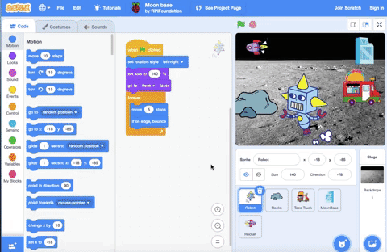

## 3D effects

In this step, you will increase the 3D appearance. To do this, you will use `Looks`{:class="block3looks"} blocks to enhance the sense of depth in your scene. You will use the `size`{:class="block3looks"} and `layers`{:class="block3looks"} blocks to make your sprites appear in front of or behind each other.

In the example below, the **Rocket** sprite that is in the distance is smaller than the **Taco Truck** and **Robot** sprites. The sprites are layered to appear to go in front of or behind each other. 

**Moon base**: [See inside](https://scratch.mit.edu/projects/451453522/editor){:target="_blank"}

<div class="scratch-preview">
  <iframe src="https://scratch.mit.edu/projects/447759319/embed" allowtransparency="true" width="485" height="402" frameborder="0" scrolling="no" allowfullscreen></iframe>
</div>

--- task ---

Resize sprites to get the effect that you want. Some sprites can stay the same size.

--- collapse ---
---
title: Set the size of your sprites
---

**Numbers in a row**: [See inside](https://scratch.mit.edu/projects/445071529/editor){:target="_blank"}

<div class="scratch-preview">
  <iframe src="https://scratch.mit.edu/projects/445071529/embed" allowtransparency="true" width="485" height="402" frameborder="0" scrolling="no" allowfullscreen></iframe>
</div>

Select the sprite that you want to resize and click on its **Code** tab. Add a `set size to`{:class="block3looks"} block and change the value in the block to the size for that sprite, as a percentage (%).

Add a percentage value below `100` to decrease its size:

``` blocks3
when green flag clicked
+set size to (80)%
```

Add a percentage value above `100` to increase its size:

``` blocks3
when green flag clicked
+set size to (120)%
```
--- /collapse ---

--- /task ---

--- task ---

When you add a new sprite, it goes to the front layer. When you drag a sprite on the Stage, it jumps to the front.

To make sure that your sprites go to the correct layer, you can program them. 

A simple approach is to send some sprites to the front and some sprites to the back:

--- collapse ---
---
title: Use front and back layers to position your sprites
--- 

**Through the window**: [See inside](https://scratch.mit.edu/projects/451497627/editor){:target="_blank"}

<div class="scratch-preview">
  <iframe allowtransparency="true" width="485" height="402" src="https://scratch.mit.edu/projects/embed/451497627/?autostart=false" frameborder="0"></iframe>
</div>

In the example, the **Window frame** sprite appears at the front. The **Avery Walking** sprite appears at the back behind the **Window frame** sprite.

Select the sprite that you want at the front and click on its **Code** tab. Add a `go to front layer`{:class="block3looks"} block:

``` blocks3
when green flag clicked
go to [front v] layer
```

Select the sprite(s) that you want at the back and click on its **Code** tab. Add a `go to back layer`{:class="block3looks"} block:

``` blocks3
when green flag clicked
go to [back v] layer
```

--- /collapse ---

When you have lots of overlapping sprites, you can program your sprites into more layers:

--- collapse ---
---
title: Program your sprites into layers
---

**Through the window with tree**: [See inside](https://scratch.mit.edu/projects/454188775/editor){:target="_blank"}

<div class="scratch-preview">
  <iframe allowtransparency="true" width="485" height="402" src="https://scratch.mit.edu/projects/embed/454188775/?autostart=false" frameborder="0"></iframe>
</div>

In the example, the **Window frame** sprite appears at the front and the **Sun** sprite appears at the back. The **Avery Walking** and **Tree** sprites are each in their own layers between the **Window frame** sprite and the **Sun** sprite.

Use the `go backward`{:class="block3looks"}`1``layers`{:class="block3looks"} block to place a sprite one layer behind the sprite at the front:

``` blocks3
when green flag clicked
go to [front v] layer
+go [backward v] (1) layers
```

Change the value in the `go backward`{:class="block3looks"}`1``layers`{:class="block3looks"} block for each sprite depending on where you want it to be positioned in relation to other sprites:

``` blocks3
when green flag clicked
go to [front v] layer
+go [backward v] (2) layers
```

--- /collapse ---

--- /task ---

--- task ---

To animate your sprite, program it to move or change costumes.

--- collapse ---
---
title: Move your sprite
---

Get your sprite to move:

```blocks3
when green flag clicked
point in direction (90)
set rotation style [left-right v]
forever
move (5) steps
if on edge, bounce
```

For more information on motion, explore [Animate using motion](https://projects.raspberrypi.org/en/projects/interactive-animation/3){:target="_blank"} in Interactive animation (Challenge project 1).

--- /collapse ---

--- collapse ---
---
title: Change your sprite's costume
---

Get your sprite to change costumes:

```blocks3
when green flag clicked
forever
next costume
wait (0.3) seconds
```

For more information on animation, explore [Animate using looks](https://projects.raspberrypi.org/en/projects/interactive-animation/5){:target="_blank"} in Interactive animation (Challenge project 1).

--- /collapse ---

--- /task ---

--- task ---

Click on the **Full Screen Control** icon above the Stage. Your project will fill your screen so you and other people can interact with it more easily. In this mode, the sprites and sliders cannot be accidentally dragged into a new position.


Run your project. When you have finished, click the **Full Screen Control** icon to minimise the project and go back to the editor.


--- no-print ---



--- /no-print ---

--- /task ---

--- save ---
